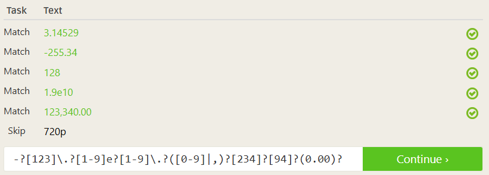

# Regex Practice Problems

## Regex Pattern Reference

| Pattern | Description |
| --- | --- |
| **abc…** | Letters |
| **123…** | Digits |
| **\d** | Any Digit |
| **\D** | Any Non-digit character |
| **.** | Any Character |
| **.** | Period |
| **[abc]** | Only a, b, or c |
| **[^abc]** | Not a, b, nor c |
| **[a-z]** | Characters a to z |
| **[0-9]** | Numbers 0 to 9 |
| **\w** | Any Alphanumeric character |
| **\W** | Any Non-alphanumeric character |
| **{m}** | m Repetitions |
| **{m,n}** | m to n Repetitions |
| ***** | Zero or more repetitions |
| **+** | One or more repetitions |
| **?** | Optional character |
| **\s** | Any Whitespace |
| **\S** | Any Non-whitespace character |
| **^…$** | Starts and ends |
| **(…)** | Capture Group |
| **(a(bc))** | Capture Sub-group |
| **(.*)** | Capture all |
| **(abc|def)** | Matches abc or def |

---

## Problem 1: **Matching decimal numbers**

### Exercise 1: Matching Numbers

## Problem 2: **Matching Phone Numbers**

### Exercise 2: **Matching phone numbers**

## Problem 3: **Matching emails**

### Exercise 3: **Matching E-mails**

1. **`^`** - Anchors the match to the start of each line
2. **`()`** - Creates a capture group to extract just the part we want
3. **`[\w\.]`** - Matches any word character (letters, digits, underscore) OR a period
4.  **`*`** Means "zero or more" of the preceding characters

## Why it stops at the right place:

The key insight is that `[\w\.]` only matches alphanumeric characters and periods. When the regex engine encounters either:

- `@` (in regular emails)
- `+` (in emails with plus addressing like `tom.riddle+regexone@hogwarts.com`)

...it stops matching because neither `@` nor `+` are included in the character class `[\w\.]`.

## Problem 4: **Matching HTML**

### Exercise 4: Capturing **HTML Tags**

## Problem 5: **Matching specific filenames**

### Exercise 5: Capturing filename data

## Problem 6: **Trimming whitespace from start and end of line**

### Exercise 6: Matching lines

## Problem 7: **Extracting information from a log file**

### Exercise 7: Extracting data from log entries

### `(\w+)` - First Capture Group (Method Name)

- `\w+` matches one or more word characters (letters, digits, underscore)
- Parentheses `()` create a capture group
- **Captures:** `makeView`, `fillDown`, `fillFrom`

### `\(` - Literal Opening Parenthesis

- The backslash escapes the `(` because parentheses have special meaning in regex
- **Matches:** the literal `(` character before the filename

### `([\w\.]+)` - Second Capture Group (Filename)

- `[\w\.]` matches word characters OR periods
- `+` means one or more of these characters
- **Captures:** `ListView.java`, `ListView.java`, `ListView.java`

### `:` - Literal Colon

- **Matches:** the `:` separator between filename and line number

### `(\d+)` - Third Capture Group (Line Number)

- `\d+` matches one or more digits
- **Captures:** `1727`, `652`, `709`

## Problem 8: **Parsing and extracting data from a URL**

### Exercise 8: Extracting data from URLs

### Part-1: `(\w+)`

- **`(`** - Opens capture group #1
- **`\w`** - Matches any "word character":
    - Letters: `a-z`, `A-Z`
    - Digits: `0-9`
    - Underscore: `_`
- **`+`** - One or more of the preceding character
- **`)`** - Closes capture group #1

### `://`

- **Literal text** that must match exactly
- This is the standard separator in URLs

**Captures:** `ftp`, `https`, `file`, `market`

### Part 2: `([\w\-\.]+)`

`(` - Opens capture group #2

### `[\w\-\.]+`

- **`[...]`** - Character class (match any ONE of these characters)
- **`\w`** - Word characters (letters, digits, underscore)
- **`\-`** - Literal hyphen (escaped to avoid range interpretation)
- **`\.`** - Literal period (escaped because `.` normally means "any character")
- **`+`** - One or more characters from this set

`)` - Closes capture group #2

**Captures:** `file_server.com`, `regexone.com`, `localhost`, `s3cur3-server.com`

### Part 3: `(:(\d+))?`

This is the **optional port section** - notice the `?` at the very end makes the entire group optional.

`(` - Opens capture group #3

`:` **- Literal colon** - the port separator in URLs

### `(\d+)`

- **`(`** - Opens capture group #4 (nested inside group #3)
- **`\d`** - Matches any digit (0-9)
- **`+`** - One or more digits
- **`)`** - Closes capture group #4

`)` - Closes capture group #3

`?` - Makes the entire group `(:(\d+))` **optional**

---
