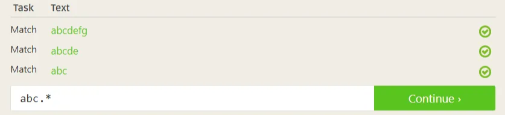
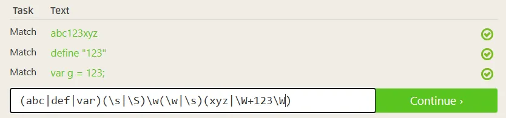
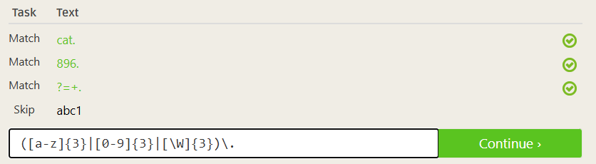

# Regex Practice Questions

## Regex Pattern Reference

| Pattern | Description |
| --- | --- |
| **abc…** | Letters |
| **123…** | Digits |
| **\d** | Any Digit |
| **\D** | Any Non-digit character |
| **.** | Any Character |
| **.** | Period |
| **[abc]** | Only a, b, or c |
| **[^abc]** | Not a, b, nor c |
| **[a-z]** | Characters a to z |
| **[0-9]** | Numbers 0 to 9 |
| **\w** | Any Alphanumeric character |
| **\W** | Any Non-alphanumeric character |
| **{m}** | m Repetitions |
| **{m,n}** | m to n Repetitions |
| ***** | Zero or more repetitions |
| **+** | One or more repetitions |
| **?** | Optional character |
| **\s** | Any Whitespace |
| **\S** | Any Non-whitespace character |
| **^…$** | Starts and ends |
| **(…)** | Capture Group |
| **(a(bc))** | Capture Sub-group |
| **(.*)** | Capture all |
| **(abc|def)** | Matches abc or def |

---

## Lesson 1: Introduction

### Exercise 1: Matching characters

### Exercise 1.5: Matching digits

## Lesson 2: The Dot

### Exercise 2: Matching With Wildcards

## Lesson 3: Matching Specific Characters

### Exercise 3: Matching Characters

## Lesson 4: **Excluding specific characters**

### Exercise 4: Excluding characters

## Lesson 5: **Character Ranges**

### Exercise 5: Matching C**haracter Ranges**

## Lesson 6: **Catching some zzz's**

### Exercise 6: Matching repeated characters

## Lesson 7: **Mr. Kleene, Mr. Kleene**

### Exercise 7: Matching repeated characters

## Lesson 8: **Characters optional**

### Exercise 8: Matching optional characters

## Lesson 9: **All this whitespace**

### Exercise 9: Matching whitespaces

## Lesson 10: **Starting and ending**

### Exercise 10: Matching Lines

## Lesson 11: Match groups

### Exercise 11: Matching groups

## Lesson 12: **Nested groups**

### Exercise 12: Matching Nested Groups

## Lesson 13: **More group work**

### Exercise 13: Matching Nested Groups

## Lesson 14: **It's all conditional**

### Exercise 14: Matching conditional text

## Lesson 15: **Other special characters**

### Exercise 15: Matching other special characters

<aside>
💡

I call MYSELF out here, lol, I got a little bored so… =]

</aside>

---
